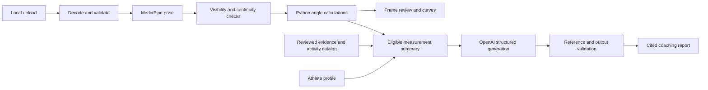

# Implementation design

## Product and scope

Track Sprint AI helps a sprinter and coach review an approximately side-on upright sprint passage. The author has experience as a sprinter, captain and informal coach. The recurring job is to turn slow-motion footage into a small number of inspectable talking points without repeatedly drawing every joint by hand.

The deliverable is a local Python app, source repository and recorded demonstration. A single foreground athlete and a standardized recording are the intended happy path. Public deployment, contact timing, force estimates, medical advice and anatomical asymmetry conclusions are outside this MVP.

## Data flow

**Local boundary:** `video.py` sequentially decodes PyAV frames, preserving their original decode indexes and presentation timestamps. Frame dimensions are aspect-corrected before geometry. `pose.py` wraps a timestamped MediaPipe VIDEO task with up to two detected poses. Largest-subject initialization and subsequent spatial/size continuity prefer the foreground runner. Ambiguous initial selection and discontinuities produce missing data.

**Measurement boundary:** landmarks are retained as raw and accepted arrays. Per-joint visibility/presence, image bounds and broad segment-length sanity checks determine availability. Knee/hip metrics are never calculated from missing inputs. A centered five-frame Savitzky–Golay filter works on valid spans using an intermediate uniform time grid; it does not bridge gaps. Smoothing is applied to angle trajectories, not to joint coordinates. That intentionally differs from the initial proposed pipeline and avoids turning repaired coordinates into apparently observed joints.

**Generation boundary:** `build_context` chooses review-side metrics with at least 85% valid coverage. Panning/moving-camera trunk and thigh orientations are excluded from AI coaching. All right-side facts are excluded when reviewing the left side and vice versa. Research retrieval is a transparent topic overlap over six manually reviewed summaries. The library is small enough that embeddings and a vector database would add complexity without a useful retrieval benefit.

The profile and retrieved data are explicitly untrusted prompt input. The LLM receives no files or tools. `CoachingReport` constrains the shape; additional checks require eligible metric IDs, supporting extrema frame IDs, retrieved source IDs and approved activity IDs. Generated prose cannot include numeric claims or arbitrary links. Numeric facts and citation links are rendered from verified input objects. This checks referential grounding, **not the truth of every semantic inference**. A human should review the report before demonstrating or using it.

## Definitions and limits

Use pixel-space coordinates with x in the athlete's direction of travel and y upward. Normalized landmark coordinates are multiplied by image width and height first.

| Quantity | Definition | Limit |
| --- | --- | --- |
| Knee flexion | 180° minus hip–knee–ankle included angle | Projected, skin/clothing/model placement affects it |
| Trunk–thigh flexion | Signed angle from shoulder→hip to hip→knee | Proxy for hip flexion; no measured pelvis orientation |
| Trunk / frame vertical | atan2 of forward and upward shoulder–hip components | Camera roll/obliquity changes it |
| Thigh / downward vertical | atan2 of forward and downward hip–knee components | Camera-relative; not angular velocity |

Positive trunk/thigh angles point forward. Straight upright trunk and downward thigh give zero trunk–thigh flexion. Extremes describe the selected interval, which can be less than a full stride. Repeated forward-thigh maxima create candidate cycle intervals when present. No heuristic identifies touchdown, toe-off, ground contact or true stride duration. Range outputs are descriptive; the app provides no ideal-angle comparison.

Tracking status is based on the minimum of knee and trunk–thigh valid coverage: usable ≥85%, limited ≥50%, insufficient below that. The words describe **tracking coverage only**. There is no automated proof of side-on camera geometry, correct side labeling or anatomical accuracy. The user must inspect the footage and confirm side when known. Both sides can be plotted for inspection without inferring strength or injury risk.

## Reproducibility and privacy

A completed run contains `summary.json`, `series.json`, `landmarks.npz`, source-indexed annotated JPEGs, original/annotated passage MP4s and `manifest.json`. The manifest records video/model hashes, model source, configuration, dependency versions, frame range, run duration and explicit playback slowdown. `manifest.json` is the completion marker. Video frames use presentation timestamps on export, not a guessed constant source rate.

UI sessions have independent random directories. Uploaded filenames are never used as filesystem paths. Downloads whitelist derived artifacts. Metadata writes use temporary-file replacement. Reports are cached by analysis, complete input context, model and prompt version. Keys never enter the cache identifier, files or logs. The profile participates in the cache hash but is omitted from the saved request context. Generated prose can still reflect the profile, so exports need review.

The local pose worker runs in a subprocess with a five-minute timeout. This protects Streamlit from a native model crash; it is not a security sandbox for untrusted media. Limits of 100 MB, 4K, two-minute source duration, ten-second selected passages and 3,600 selected frames bound the normal path. A 24-hour inactivity cleanup runs on new session creation. There is no background cloud storage or user account system.

## Decisions

| Choice | Reason | Alternative / cost |
| --- | --- | --- |
| Streamlit | One Python stack, fast local review UI | React would improve synchronized playback but adds a second stack |
| PyAV | Successfully decodes the supplied HEVC file with actual timestamps | Native AVFoundation decoding was unreliable under the coding sandbox |
| MediaPipe Full 0.10.35, CPU delegate | Real demo inference completed; rich landmarks and confidence fields | 1.0.1 crashed on the tested Mac; no model accuracy claim follows from selecting Full |
| Frame slider | Exact frame-to-chart alignment | Original and annotated video players remain independent |
| Six reviewed summaries | Auditable retrieval in a small domain | Broader research retrieval needs curation/evaluation first |
| Hosted structured LLM call | Meaningful generative interpretation with bounded outputs | No local LLM fallback or fake report in this build |
| No clinical conclusions | Input cannot support them | Medical assessment requires a different evidence and validation standard |

## Next useful improvements

Before broadening features: obtain a real API report, manually validate a small annotation set, and test a second standardized clip and a deliberate poor-view clip. Then improve manual camera-side confirmation, athlete selection, exported visual review summaries and video synchronization. A real hosted product would require an upload worker queue, authentication, durable job storage, operational monitoring, stronger abuse/resource limits, privacy policy and wider device/video testing. Those are future work, not claims about this local MVP.
