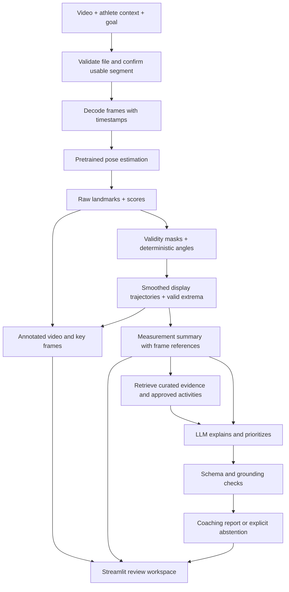

# Track Sprint AI — approved MVP plan

Status: **Approved for implementation. This document preserves the original planning rationale; see DESIGN.md and VALIDATION.md for actual implementation and test status. Source code and a local demo are submission deliverables. Public hosting is not required.**

Planning date: September 9, 2026, America/New_York. Submission deadline: **Saturday September 12 at 11:59 p.m.**, assuming Eastern time unless corrected. You can spend a couple of hours per day and prefer to prompt periodically while I handle implementation. A **local app and recording suffice**. An API budget is available, and the hosted LLM API is now a deliberate product requirement while usage remains tightly bounded. The proposed demonstration video, `IMG_2811.mov`, has now been visually inspected as described below. The workspace initially contained only Git metadata. Python 3.13 is on PATH; FFmpeg/ffprobe was not found on PATH. The machine reports arm64; memory inspection was unavailable in the sandbox. API credentials/access, dependency compatibility, pose quality, and programmatic video decoding remain implementation checks, not completed setup.

## 1. Product and success definition

Track Sprint AI is a **single-video, side-view sprint review assistant** for sprinters and coaches. It extracts estimated body landmarks, calculates explicitly defined two-dimensional motion features, and uses a language model with curated evidence to explain a small number of supported observations and suggest coaching experiments.

The first version supports one athlete running upright on a straight at approximately maximum velocity. It does not establish that the athlete is at maximum velocity from video alone. The athlete supplies that context. It does not diagnose injury, infer muscle weakness, measure forces, or grade athletes against an alleged universal ideal.

The core value proposition is reducing the work between “I recorded a sprint” and “I can review a few useful frames, consistent measurements, and an understandable explanation.” Your experience as a sprinter and coach helps define the review workflow and judge whether explanations are useful. It does not replace measurement validation.

The narrowest impressive demonstration is: **your real video → colored skeleton → three angle plots and selected frames → a generated, source-linked explanation that visibly refers to those measurements.** A successful result can include an observation that needs no correction. It must never manufacture three problems to fill the page.

Initial users: individual sprinters, volunteer coaches, and small track teams. The initial product hypothesis is that an auditable explanation saves review time and makes feedback easier to understand. Test it with a few athletes/coaches using their existing review process as the comparison; pricing and market-size claims would be premature.

## 2. Information needed before finalizing

1. Confirm that the shirtless foreground athlete is you/the intended athlete and that this is the sprint phase you want reviewed. The footage looks like upright sprinting, but effort and intent cannot be proved from video alone.
2. Correct the Eastern-time deadline assumption if needed. The local-delivery requirement and budget preference are now settled.

These are scope questions, not requests to choose libraries. Implementation remains gated by your explicit approval of the resulting plan.

### Video inspection, once supplied

Before implementation, inspect available metadata and representative frames using existing tools. Check rotation, codec, resolution, duration, presentation timestamps, variable frame rate, duplicate/interpolated frames, full-body visibility, athlete size, camera motion, lighting, motion blur, and overlap with people or objects. Inspect feet as well as torso: visible body does not guarantee visible ankle or toe landmarks.

Record a usable interval, running direction, and near-camera side when identifiable. The UI should permit user confirmation of these; a single-pose model does not prove that only one person is present, and pose scores do not certify a side view. Camera suitability combines an explicit recording checklist, visible quality indicators, and inspection, not an overpromised automatic classifier.

Accept an approximately 3–10-second uploaded clip, but analyze its usable central passage. A stationary camera may capture only about a second or two of sufficiently large, nearly perpendicular full-body footage. Prefer at least two complete cycles of the visible leg for repeated summaries. One complete cycle permits a clearly labeled single-cycle summary; shorter intervals permit frame measurements and plots only. Never imply repeated evidence from a partial cycle.

Capture FPS and playback FPS are different. A 240 FPS capture exported as a 30 FPS slow-motion file may preserve the images but change the time scale. Without verified capture-to-playback mapping, show angles against video time or frame index, and disable real-time cadence and other timing claims. Upsampling does not restore missing temporal information.

After approval, the first code milestone tests actual pose quality. Metadata inspection alone cannot establish it. If the footage is unsuitable, first try a different segment or a better recording. Do not build the full app around a failed pose demonstration.

### Demonstration-video findings: `IMG_2811.mov`

The file opens and plays normally in QuickTime Player. QuickTime reports 1920 × 1080 landscape HEVC video, 8-bit BT.709 color, 30.4 MB at about 17.88 Mbit/s, with AAC audio. It plays for about 13 seconds. QuickTime reports an unusual encoded rate of 172.03 FPS; combined with the playback/source-timeline behavior, this is a slow-motion asset with timing metadata rather than a simple constant-rate 60 FPS clip. The app must inspect decoded timestamps and must not assume 172.03 is the camera capture rate.

The clip begins with the athlete approaching from the distance, passes through a clear side-on view, and ends with the athlete moving away. The camera operator pans to follow the athlete. In the middle passage, the athlete is large and sharp, the full body and both shoes are visible, and the view is close to perpendicular. A second runner is visible behind the main athlete during part of the approach, although the main athlete is substantially larger in the useful interval.

This means the clip is suitable for the core demonstration, subject to the actual pose test. The app will analyze a user-confirmed central interval rather than the entire video. It will also confirm the foreground athlete, right-to-left travel direction, and camera-facing side. The pipeline must reject any frames where tracking switches to the background runner.

The moving camera does not invalidate angles formed between body segments, such as knee flexion or the trunk-to-thigh proxy. It does weaken absolute trunk orientation relative to image vertical because camera roll can change during the pan. For this clip, trunk orientation is a secondary descriptive display. Timing, contact events, speed, distance, far-side measurements, and left/right asymmetry are outside the primary report unless they independently pass later checks.

The current command-line media stack could identify the QuickTime container but did not decode frames, even though QuickTime plays it. Treat this as an HEVC/tool compatibility problem for the first implementation milestone, not as evidence that the video is damaged. The likely path is to use FFmpeg for inspection and create a browser-compatible H.264 working/output copy while preserving the mapping back to source frames.

## 3. Scope and feasibility

The labels below describe what the **MVP can support**, not clinical validation. “Reliable” concerns software behavior or direct file information. All anatomical estimates remain conditional on camera geometry and pose quality.

| Proposed output | Classification | MVP decision |
|---|---|---|
| Original video and source-frame index | Reliable | Required; preserve source and display it |
| Skeletal overlay and separate left/right colors | Approximate anatomy; reliable rendering | Required; labels are model-assigned anatomical sides, never screen sides |
| Frame-specific knee angle | Approximate | Required for sufficiently visible near-side joints |
| Frame-specific hip angle | Approximate proxy | Required as **trunk–thigh angle**, with its convention visible |
| Trunk inclination | Approximate proxy; limited by camera motion | Secondary required display as orientation relative to frame vertical; avoid small absolute-lean claims for this clip |
| Knee/hip/trunk trajectories | Approximate measurements | Required; gaps and smoothing are visible |
| Vertical hip reference and body segment | Approximate reference | Required; no center-of-mass or pelvic-tilt claim |
| Highlighting uncertain/missing landmarks | Reliable display of quality flags | Required; distinguish missing from merely low-score |
| Pose confidence | Reliable model-score reporting; approximate quality inference | Required; never a probability that angles are correct |
| Automatically selected key frames | Approximate | Required: valid extrema with spacing; no event labels unless validated |
| Front/rear thigh excursion | Approximate | Required if complete motion and valid extrema are available; descriptive only |
| Foot position relative to hip at a selected frame | Approximate | Optional, dimensionless and explicit about reference landmark |
| Foot position at estimated touchdown | Experimental | Optional only after event checks; touchdown is not the lowest-foot frame |
| Stride phases / contact events | Experimental | Optional candidate events with uncertainty or manual confirmation |
| Left/right range or timing difference | Experimental | Excluded from the primary report for this clip; optional only if visibility and comparable cycles unexpectedly pass validation |
| Frame slider synchronized with plot markers | Reliable UI behavior | Required |
| Continuously synchronized video playback and plots | Reliable engineering, additional scope | Optional after core completion |
| Up to 2–3 observations with evidence and uncertainty | Experimental interpretation of approximate data | Required; aim for 1–2 strong observations for this clip, and permit zero if pose quality is insufficient |
| Cues, drills, strength exercises | Experimental individual applicability | Required report capability, conditional on evidence and context; no forced prescription |
| Short training recommendation | Experimental individual applicability | Optional; no personalized rehabilitation or aggressive loading progression |
| Speed or stride length in meters | Unsuitable without spatial calibration | Excluded |
| Ground-contact time as a precise number | Unsuitable as a dependable core feature | Excluded; event frame counts may be explored privately |
| Pelvic tilt/rotation, true 3D joint angles, center of mass | Unsuitable from this setup/model representation | Excluded |
| Forces, power, activation, tissue loading, injury diagnosis/risk score, strength inference | Unsuitable | Excluded |

Visible-side measurements should lead the report. A walking validation study found substantially worse agreement for occluded-side hip and knee angles; its results motivate caution but do not quantify sprinting error for our models. [Occlusion study](https://pubmed.ncbi.nlm.nih.gov/37943887/).

Future scope: multiple camera views, camera calibration, carefully validated contact timing, broader model evaluation, coach-reviewed longitudinal comparisons, and eventually phase-aligned reference data with comparable collection protocols. Starts, curves, arbitrary views, athlete accounts, payments, live coaching, and model training are outside this build.

## 4. Technology decisions

| Component | Recommendation | Alternatives and decision rationale |
|---|---|---|
| UI | Streamlit | Best fit for your Python skills and a few-day local demo. React plus an API provides more playback control but introduces a second stack. Gradio is plausible for a simple model demo but offers no decisive advantage for this review workspace. |
| Pose model | Start with MediaPipe Pose Landmarker, Full model, offline VIDEO mode | Provides heel/foot landmarks useful for optional foot review. Try Heavy only if specific failures improve enough to justify runtime. MoveNet Thunder is the bounded fallback for core hip/knee/trunk tracking. |
| Video | OpenCV plus FFmpeg/ffprobe | OpenCV for decoded RGB frames and drawing; FFmpeg for the demo's HEVC input, slow-motion timing inspection, and browser-compatible H.264 export. Stream frames rather than keeping every RGB image in memory. |
| Math | NumPy, small SciPy smoothing utility; pandas for tabular export if useful | Explicit equations and validity masks; no biomechanical inverse-dynamics framework. |
| Charts | Plotly | Three compact plots with matching side colors and common time axis. |
| LLM | OpenAI Responses API with GPT-5.4 Mini and Structured Outputs | Makes the product's generative-AI integration explicit and gives dependable schema-constrained output. Keep one narrow call per analysis, save the result, and use a local model only as an outage/development fallback. No fine-tuning, agents, or tool loop. |
| Research retrieval | Curated JSON records with topic filters and lexical ranking | Genuine retrieval from a small library. A vector database and embeddings add little for perhaps 6–8 carefully selected sources. |
| Schemas | Pydantic | Typed inputs/results and explicit null values with reasons. |
| Storage | Session-local temporary artifacts; deliberate local demo export | No database or accounts. Content hashes identify exact input/configuration combinations. |

MediaPipe exposes 33 landmarks, visibility/presence outputs, and a timestamped blocking video mode. Use VIDEO rather than the live asynchronous path, which can ignore frames while busy. Its inferred world coordinates are not a calibrated measurement of your sprint; the MVP uses 2D pixels. [MediaPipe Python guide](https://developers.google.com/edge/mediapipe/solutions/vision/pose_landmarker/python).

MoveNet exposes 17 keypoints; Thunder prioritizes accuracy and Lightning prioritizes latency. The standard skeleton has ankles but no heel/toe points. [Official MoveNet tutorial](https://www.tensorflow.org/hub/tutorials/movenet). A sprint-specific VideoRun2D preprint using an adapted MoveNet pipeline reports encouraging angle agreement against manual labeling, but those results do not transfer automatically to a stock model or our video. [VideoRun2D](https://arxiv.org/abs/2409.10175).

**Model choice is provisional. Neither general benchmark speed nor additional landmarks establishes superior sprint accuracy.** After approval, inspect approximately 20–30 frames spanning the actual stride. Start with MediaPipe; if persistent joint drift, side swaps, or missed limbs make it fail our acceptance checks, spend at most about two hours testing MoveNet Thunder. Prefer the model that passes the core metrics on the real clip; drop foot extras if necessary. Do not build a permanent two-model ensemble.

Streamlit's documented video control is not a frame-by-frame callback mechanism; its start/end offsets round floating values down to seconds. Therefore an image/frame slider is the dependable first synchronization design. [Streamlit video API](https://docs.streamlit.io/develop/api-reference/media/st.video).

You confirmed that a local app and recording suffice, so there is **no hosting work in this MVP**. This environment's Sites runtime uses Cloudflare Workers; our native Python/OpenCV inference pipeline would need a separate Python service or a different browser-side architecture. Preserve Streamlit for your local workflow. If the requirement changes, reassess hosting and schedule explicitly. No site has been scaffolded or published.

### API decision for a Generative AI Club application

A paid cloud API is not technically required to use generative AI, but it is the better product decision for this submission. The club's focus on shipping AI products makes a real hosted-model integration easier to understand and defend than a local-runtime detour. The application will use the OpenAI Responses API for one bounded text-generation step after the deterministic video analysis.

The request will contain only computed measurements, quality/uncertainty flags, the minimal athlete profile, and retrieved passages from our reviewed evidence library. It will not upload the raw video or every frame. The response will use a strict schema for observations, measurement references, evidence references, uncertainty, cues, and activities. OpenAI's current documentation lists Structured Outputs support for GPT-5.4 Mini and the Responses endpoint. [GPT-5.4 Mini](https://developers.openai.com/api/docs/models/gpt-5.4-mini), [Responses API](https://developers.openai.com/api/reference/resources/responses/methods/create).

GPT-5.4 Mini is the starting model because the task needs careful synthesis but has a small text input. Current official pricing is $0.75 per million input tokens and $4.50 per million output tokens. A representative 4,000-token input plus 1,500-token output would cost about one cent; actual usage can vary, especially if reasoning tokens are used. The app will show neither live pricing nor a false exact cost estimate. [Official model pricing](https://developers.openai.com/api/docs/models/gpt-5.4-mini).

Save the real generated report with the input-analysis hash. The recorded demo can replay that report without a second API call while clearly labeling it as a saved result from the same real analysis. A new video requires a new API call for coaching. Hard-coded coaching or a template alone would not satisfy the generative requirement.

The product story is therefore precise: a pretrained pose model estimates landmarks locally; deterministic code measures motion; local retrieval selects relevant reviewed evidence; and a hosted generative model turns those verified inputs into a personalized, structured explanation. The API is meaningful because it performs synthesis and communication that varies with the measurements, evidence, athlete context, and goal.

## 5. Exact measurement definitions

Use aspect-corrected image coordinates. If the model provides normalized x/y, multiply x by image width and y by image height before calculating angles. Undo crop/letterbox transforms. A formula applied directly to independently normalized x/y distorts angles on nonsquare images.

Let coordinates use **x forward along the athlete's running direction and y upward**. Preserve original image coordinates separately for drawing. With normalized input, x can be direction_sign × width × x_normalized and y = −height × y_normalized. Direction comes from user confirmation or inspected travel, not a silent left/right assumption. Correct known image rotation; use image vertical as a proxy for vertical and disclose unknown camera roll.

For one side, S, H, K, A are shoulder, hip, knee, ankle. Angles below are in degrees. Degenerate vectors, missing landmarks, out-of-bounds points, or invalid segments produce no measurement.

| Metric ID | Definition | Interpretation and limits |
|---|---|---|
| knee_flexion_deg | 180 − acos(clamp(((H−K)·(A−K))/(\|H−K\|\|A−K\|), −1, 1)) | 0° is straight; 90° is a right-angle bend. Projected knee flexion, not an exact anatomical joint angle. |
| trunk_lean_deg | atan2((S−H)x, (S−H)y) | 0° is image vertical; positive means forward lean. Prefer the same visible-side shoulder/hip pair throughout a segment. |
| hip_proxy_deg | atan2(cross2(H−S, K−H), dot(H−S, K−H)) | Signed trunk–thigh flexion: 0° for thigh aligned with downward trunk; positive for thigh forward. No pelvic orientation is measured. |
| thigh_forward_deg | atan2((K−H)x, −(K−H)y) | Thigh orientation relative to downward vertical; positive in front, negative behind. Different from the trunk-relative hip proxy. |
| front_excursion_deg | max(0, maximum valid thigh_forward_deg within a complete cycle) | Descriptive front-side angular excursion; no universal target. |
| rear_excursion_deg | max(0, −minimum valid thigh_forward_deg within a complete cycle) | Descriptive rear-side angular excursion. |
| thigh_rom_deg | maximum − minimum thigh_forward_deg within that cycle | Requires valid extrema; cannot claim full ROM through an unobserved peak. |
| ankle_ahead_hip_norm | (Ax−Hx)/Lref, where Lref = median(\|H−K\|+\|K−A\|) over accepted frames | Optional projected ankle-to-hip offset in apparent leg-length units. No centimeters, foot contact point, COM, or braking-force claim. |
| usable_frame_fraction | accepted frames for this metric / frames in the declared selected interval | Coverage measure; not “accuracy.” Also show longest missing interval. |

Use a fixed, documented landmark convention within each segment. The optional pelvis marker is the midpoint of the two hips only when both are usable; otherwise display the visible hip and label it accordingly. Do not quietly substitute one for the other in metric comparisons. A vertical line through the reference point is a visual aid, not pelvic tilt or a whole-body balance assessment.

Unwrap signed angular trajectories within continuous valid intervals before smoothing/peak logic, then convert back for presentation. Summarize cycles individually and, if repeated, display median plus range and the cycle count. Avoid implying statistical population confidence from a few strides.

For optional asymmetry, compare the same cycle-level metric and report L−R in degrees or time with sample counts. If using a percent range difference, explicitly define 100×\|L−R\| / ((\|L\|+\|R\|)/2), with a near-zero denominator guard. Disable timing unless real time is verified. Disable comparisons when sides have dissimilar coverage, unresolved identity swaps, or incomplete cycles. A difference never proves weakness, injury causation, or a need to strengthen one side.

Do not use entered height as a substitute for in-plane camera calibration. Body projection changes during motion. Speed and distance require spatial calibration and trustworthy time; contact time additionally requires validated event detection. At 60 FPS a frame spans about 16.7 ms; if two boundaries each have one-frame uncertainty, duration can differ by about 33 ms. Higher FPS helps temporal sampling but does not remove pose error.

## 6. Quality, smoothing, and event selection

Store raw landmarks and raw model scores unchanged. Per-metric validity depends on every required joint plus checks for impossible coordinates, implausible discontinuities, rapidly changing segment lengths, and identity ambiguity. Do not silently relabel left/right to make a smooth graph.

Starting configuration for the feasibility test: require available landmark visibility/presence scores of at least 0.7 for measurement use, then inspect whether this rejects or retains appropriate frames. This is a tunable engineering threshold, not a validated confidence cutoff; model-level detection/tracking settings and per-landmark filtering are distinct.

For `IMG_2811.mov`, select the central passage before pose inference. Because the camera follows the athlete, first try a moderate fixed crop that still contains the full athlete throughout the segment; retain the full frame if that crop does not work. Check subject continuity using the previous pose location, apparent body size, and frame-to-frame movement so the model cannot silently switch to the smaller background runner.

For the first implementation, compute raw angles on accepted frames and apply one short centered smoothing pass within continuous valid angular segments. Start with a five-frame, second-order Savitzky–Golay filter on verified uniformly sampled data; inspect its duration in milliseconds and whether it flattens peaks. Use timestamps to resample only if needed, recording the transform. Do not smooth across long gaps, segment boundaries, or side swaps. The raw plot remains available for review. Avoid stacking several filters on top of the model's temporal tracking.

Prefer leaving missing values as gaps. If interpolation is added for display continuity, restrict it to short bracketed gaps (at most two frames and 35 ms), visibly flag it, and exclude interpolated extrema and event boundaries from report evidence. Missing does not mean zero, and a smoothed or interpolated point does not gain confidence.

Key frames initially come from valid knee-flexion and thigh-angle extrema with time separation. Labels say “maximum observed forward thigh position,” for example, rather than inventing touchdown or flight. Candidate cycle boundaries can use repeated same-leg thigh maxima after checking sequence consistency; these delimit motion cycles, not contact events.

Touchdown is optional: seek a candidate transition from descending foot to a stable ground-proximate interval using heel/toe/ankle evidence and a user-confirmed ground reference if needed. Reject contradictory or occluded candidates. A lowest ankle position alone is insufficient. Show a frame interval and allow manual confirmation. Record whether an event is automatic, edited, or manually provided. If the detector fails, remove event-specific recommendations and retain valid frame-based analysis.

## 7. Architecture and data contracts



Data objects:

- `VideoMetadata`: content hash, codec, dimensions, rotation, frame indices/presentation times, verified real-time mapping or unknown, selected segment and confirmation notes.
- `PoseFrame`: original frame ID/timestamp, landmark coordinates, scores, and validity reasons.
- `MetricSeries`: metric ID, side, units/convention, raw values, display values, validity/interpolation flags.
- `CycleOrEvent`: type, frame interval, method, confidence reason, user edits, and supporting frames.
- `AnalysisSummary`: approved numeric facts, sample counts, quality limitations, key-frame IDs, and available topics for retrieval.
- `EvidenceRecord`: stable ID, title/authors/year/link, passage location, verified short passage or attributed summary, study population/setup, topic tags, evidence type, allowed and unsupported claims.
- `CoachingReport`: status, up to three observations, referenced metric/frame IDs, evidence IDs, explanation, uncertainty, candidate activity IDs, and follow-up review suggestion.
- `RunManifest`: input/segment hash, transforms, pose-model asset hash, dependency/config/schema versions, code revision when available, evidence version, prompt version, LLM identifier, timings, validation results, and saved response.

Process frame by frame and store compact landmark tables; extract only selected images for interactive review. Stream rendering in a second pass if needed. The UI consumes saved analysis artifacts instead of rerunning pose inference whenever a widget changes. Profile-only changes can regenerate interpretation without recomputing pose.

Keep two cache identities: video/segment/model/config for deterministic analysis; summary/profile/evidence/prompt/LLM settings for reports. Preserve the exact saved response for reproducible demo replay; a fresh LLM call can differ even with the same settings. A replay is labeled “saved analysis” and its manifest proves what produced it. A new video must never receive an unrelated demo report.

## 8. Meaningful generative AI and evidence guardrails

The LLM performs constrained synthesis: select the most useful supported observations, explain measurements in athlete-appropriate language, connect them to applicable evidence, and suggest a small review or practice experiment. Experience/event/goal can change wording and priorities. They must not change the underlying measurements.

Default required profile inputs: primary event, experience, and stated goal. Age band is useful context; exact age, height, and weight need not block analysis. Height/weight do not unlock extra mechanics calculations. Injury history is optional and minimized; consider an optional current-pain flag to suppress exercise advice and recommend professional discussion. Do not infer current symptoms from an old injury.

Do not send video or key frames to the LLM initially. Send only the compact summary and explicitly permitted athlete context. Frames add privacy and prompting complexity without being necessary to explain these metrics. Multimodal context can be evaluated later, with computed measurements remaining authoritative.

Use approximately 6–8 curated sources and 12–20 short evidence records, selected during implementation. Retrieve approximately 3–5 relevant records by supported observation topic, with study population/phase applicability and evidence strength considered. A topic/lexical matcher over a small library is legitimate retrieval-augmented generation; embeddings are optional infrastructure, not what makes RAG meaningful.

Every activity suggestion should come from a small reviewed catalog. Separate evidence for a biomechanical association from evidence that a drill changes it. A citation about sprint kinematics does not prove an A-skip will fix an observed pattern. If an activity is based on coaching practice, label that basis; if its individual applicability is unsupported, omit it. No personalized medical rehabilitation or invented exercise dosage.

Example report fields, without fabricated athlete findings:

`observation_id, metric_refs, frame_refs, explanation, evidence_refs, uncertainty, cue, drill_id, exercise_id, next_review`

Numeric cards and observation fact lines are rendered from approved metric IDs in application code. The model selects references and supplies explanations, not replacement numbers. Use an allowlist for citations and activities. User profile text and retrieved passages are data, never instructions.

Validation checks:

1. Parse against the strict schema; bound counts and text length.
2. All metric/frame/evidence/activity IDs must exist and be available for that run.
3. Insufficient-quality metrics cannot support coaching observations.
4. Do not allow generated numeric claims to override source facts; reject unsupported quantities, normative thresholds, and unsupported side comparisons.
5. Screen unsupported diagnosis, causation, weakness, force/power, certainty, and rehabilitation language.
6. Check citation-to-claim relevance during curated mapping and manual report review, not just whether a citation ID exists.
7. Permit one repair request, then withhold the failed report and show measurements with an explicit explanation.

These reduce hallucinations but do not guarantee semantic truth. Structured JSON validates form, not clinical or scientific correctness. The demo requires human review of the actual report. If no recommendation is defensible, an evidence-grounded description and recording-improvement guidance are appropriate.

Initial verified research leads include a study that did not support a simple universal front-side-mechanics performance rule in its sample, and a thigh-motion study reporting associations with running speed. Neither establishes a personalized corrective target. [Front-side mechanics](https://pubmed.ncbi.nlm.nih.gov/28872386/), [Thigh angular motion](https://pubmed.ncbi.nlm.nih.gov/32917763/). The final library must include both supporting and limiting findings, with inspected passages and no unverified invented citations.

## 9. Interface and demo

One page with a short input panel and a review workspace. Use a restrained track-oriented visual theme, readable charts, and consistent cyan/orange anatomical-side colors plus text labels. Low-quality landmarks are gray/dashed; absent landmarks are omitted. Show the quality explanation beside results, not only in a footer.

Flow: profile and video → confirm segment/direction/view → Analyze → real stage progress → original/annotated video → selected-frame review and charts → coaching report and evidence.

Required interaction: a frame slider changes the extracted annotated frame, that frame's available numeric values, and the vertical cursor on all plots. Video playback is independent in the first version. Downloads include the annotated MP4 and a JSON run/report artifact; a generated PDF is unnecessary for MVP.

The progress display reflects actual work: validate, decode/track, measure, render, retrieve, generate. Never show invented processing delays during saved replay. If processing takes too long for the recording, cut forward or explicitly open a previous real analysis.

Provisional 80-second demo:

| Time | Screen and narration |
|---|---|
| 0–10 s | “As a sprinter and coach, I spend time scrubbing videos. This helps organize that review.” Enter event/experience/goal. |
| 10–20 s | Upload your clip, show suitability confirmation, start real analysis. Cut forward if necessary. |
| 20–35 s | Play annotated motion: explain the model estimates joint positions and math computes the displayed angles. |
| 35–50 s | Select a key frame; show matching angle values and graph cursors. Point out one uncertainty flag. |
| 50–70 s | Open an actual generated observation, its measured evidence and citation. Explain why the suggested experiment fits the goal. |
| 70–80 s | “This estimates 2D motion; it cannot diagnose injuries or measure strength. Next I would validate across more athletes and camera setups.” |

Record only claims present in the completed analysis. The script becomes specific after inspecting the real report.

## 10. Proposed repository

```text
app.py                         # Streamlit presentation and session flow
src/track_sprint/
  schemas.py                   # Explicit data contracts
  pipeline.py                  # Sequential orchestration
  video.py                     # Metadata, timing, transforms, decoding
  pose.py                      # One active pretrained-model adapter
  quality.py                   # Per-joint and per-metric validity
  metrics.py                   # Pure angle/feature calculations
  events.py                    # Extrema/cycles; optional contact candidates
  render.py                    # Overlay frames and video export
  evidence.py                  # Curated retrieval
  coaching.py                  # LLM call and report validation
  artifacts.py                 # Manifest, session files, cache identities
evidence/
  sources.json                 # Reviewed sources and allowed claims
  activities.json              # Reviewed cues/drills/exercises
tests/
  test_metrics.py
  test_quality.py
  test_pipeline.py
  test_coaching.py
  fixtures/                    # Synthetic or explicitly permitted test data
docs/
  MVP_PLAN.md                  # This proposal
  DESIGN.md                    # Actual architecture and decision log
  VALIDATION.md                # Checks, measured errors, failures
  LIMITATIONS.md
  DEMO_SCRIPT.md
  INTERVIEW.md
  WALKTHROUGH.md
  ROADMAP.md
README.md
pyproject.toml                 # Compatible dependencies and test settings
<dependency lockfile>
.env.example                   # Names only, no real API secrets
.gitignore
```

Local `models/` and `artifacts/` are ignored. Record model download source, version/hash and license; do not commit athlete video or API secrets. Prefer a few clear modules over generic plugin systems. During early slices, adjacent responsibilities can share a module if separation would add ceremony.

## 11. Acceptance criteria and validation

Numerical thresholds below are **proposed engineering acceptance targets for this demonstration**, not validated scientific accuracy claims. Freeze them before evaluating held-out frames; report misses and reduce scope rather than silently loosening targets.

| Component | Acceptance gate |
|---|---|
| Input validation | Decode actual content; reject corrupt/unsupported/oversized input with a specific message. Initial limits: 100 MB, 10 s selected analysis duration, 1080p analysis resolution. Correctly handle the demo's 1920×1080 HEVC slow-motion container and record source mappings. |
| Suitability | For the demo: central interval, foreground athlete, right-to-left direction, camera-facing side, usable-cycle count, moving-camera warning, and timing status recorded. Poor input can return limited analysis instead of confident feedback. |
| Pose | Skeleton visually follows the foreground athlete in the selected segment and never jumps to the background runner; no unresolved side swap is treated as valid. Target ≥85% usable near-side frames per core metric, with invalid spans shown. |
| Numerical correctness | Synthetic straight/right-angle cases within 0.1°; translation, uniform scale, direction reversal with corrected direction, crop inversion, and aspect-ratio conversion behave correctly. Invalid vectors return unavailable values. |
| Video agreement | Manually annotate 20–30 predefined frames spanning phases, including difficult frames. On accepted frames, initial target median absolute error ≤8° for each core proxy, using the same definitions; report error distribution, signed bias, max error, and coverage, not only a mean. Failed metrics are downgraded or omitted. |
| Smoothing | Raw/display curves can be compared; no bridging invalid intervals. With modest filter changes, core summaries should generally stay within about 5° and interpretations should not reverse. Otherwise flag sensitivity and suppress that observation. |
| Key frames | At least three distinct valid representative frames when footage permits; each maps to the correct source frame and the stated feature. No forced key frame from a missing-data span. |
| Optional events | Compare to independently inspected contact brackets; target ≤2 verified capture frames discrepancy for displayed candidates, with uncertainty stated. If not met, use manual confirmation or remove contact-specific features. This does not validate ground-contact-time reporting. |
| Rendering | Annotated H.264 MP4 plays in the target browser; colors/labels are consistent; overlay matches the frame. Correct orientation and chosen timing; output duration matches the selected source/playback mapping within one output frame. |
| Frame review | Slider frame, angle cards, and graph markers refer to the same source frame; unavailable values remain unavailable. No video reprocessing on slider/profile reruns. |
| Retrieval | Every returned citation resolves to the curated source; at least six manually checked topic/quality cases yield appropriate or explicitly empty evidence. No evidence means no fabricated citation. |
| LLM | Schema-valid actual report, all references verified, no contradictory numbers or prohibited conclusions in the fixed test set. Test poor quality, missing metrics, asymmetry, old injury, current pain, and malicious profile text. Review the real demo report manually. |
| Failure handling | LLM timeout/bad JSON does not erase valid measurements; no pose yields a useful retake message. Export failure preserves other outputs and is fixed before the recorded-video deliverable is considered complete. |
| Reproducibility | Same input/config yields matching metric artifacts within documented numeric tolerance; saved response and manifest recreate the actual demo. A changed input/config cannot reuse stale results. |
| Performance | Benchmark the actual laptop. Provisional goal: a five-second 60 FPS clip completes within about two minutes, and saved-result loading within five seconds after model setup. These are targets, not current measurements. |
| Teaching/docs | You can explain the equations, a missing-landmark case, retrieval, report checks, and one observed failure using the actual code and artifacts. Clean-environment setup is tested. |

Manual video annotation tests agreement with human 2D labeling, not gold-standard 3D anatomy. Repeat a subset of labels after a break, or ask a second reviewer to label a subset, to expose reference uncertainty. If uncertain frame labels are excluded, document them and report coverage. Never cherry-pick only the cleanest examples.

Use one tuning interval and a separate held-out interval or second clip where possible. If only one short video exists, state explicitly that this is a single-clip engineering demonstration with no generalization claim. Include a few consented or derived stress cases: blurred/degraded footage, missing joints, incorrect direction configuration, altered timing metadata, and an empty/corrupt video. Synthetic fixtures test math and behavior; they never stand in for the actual demo analysis.

## 12. Schedule and fallback order

Deadline: **Saturday September 12, 11:59 p.m., assumed Eastern time**. Target a complete working path by Friday evening, leaving Saturday for validation, the recording, and a submission buffer. This is a scope target, contingent on the video and first pose check. Agent implementation runs during active work sessions; the dated plan is not a promise of work occurring between prompts.

Your involvement should be about **1–2 hours per day**, concentrated on video selection, short review decisions, manual measurement checks, learning, and recording. You do not need to micromanage individual files. The initial 18–24-hour estimate described total hands-on project effort, not a demand for that much of your personal time; with agent implementation, use the following milestone gates instead of treating that estimate as a forecast.

| Phase | Your involvement | Work and exit gate |
|---|---|---|
| Wed Sep 9: planning | 15–30 min | Supply video, review proposal, approve implementation. If approval comes later, compress optional work. |
| Thu Sep 10: feasibility | 45–90 min across short checkpoints | I handle HEVC/slow-motion decode, central-segment selection, real pose/export, equations and an API connectivity/schema smoke test. You confirm the athlete/camera-facing side and review a small manual sample. Exit with credible skeleton and angle data from `IMG_2811.mov`. |
| Fri Sep 11: complete product path | 45–90 min | I build UI, frame review, small evidence library, generated report, checks and draft docs. You review one real coaching report and learn the key pipeline. Exit with a working end-to-end app. |
| Sat Sep 12: validation and delivery | 60–120 min | Fix remaining core issues, verify setup and reproducibility, finish walkthrough/interview notes, record the demo and submit. Target final recording by early evening, before the 11:59 p.m. cutoff. |

At each stage: I explain the component briefly, implement the bounded slice after approval, walk you through one real result and a failure case, and record the decision and alternative. You should be able to make one small intentional change and explain its effect. A short prompt can authorize the next milestone once this plan is approved; I will handle routine implementation choices within the approved scope. Your interview preparation still requires active attention—possessing a generated repository will not substitute for understanding it.

If fewer than about 12 hours remain, cut to one visible side, the three core angle proxies, three valid frames, basic plots, one or two supported observations, and local recording. Remove automatic events, asymmetry, continuous synchronization, and detailed training advice. Preserve real inference, citations, abstention, and reproducibility.

| Highest risk | Fallback |
|---|---|
| Blurred, small, occluded athlete | Better segment/recording first; carefully inspect crop; never claim upscaling creates detail. If no usable joints, stop coaching and request a suitable recording. |
| HEVC/slow-motion decode mismatch | Verify frame count and timestamps using FFmpeg; transcode a working copy while preserving source-frame mapping. Export H.264 for the browser. If capture timing remains ambiguous, use frame position and omit timing metrics. |
| Background runner captures the pose model | Restrict the central interval/crop and enforce subject continuity; invalidate ambiguous frames. Do not report results until overlays show the foreground athlete throughout. |
| Camera pan/roll changes frame vertical | Keep joint-to-joint angles; label trunk orientation relative to frame vertical and drop trunk-derived coaching if sensitivity is material. |
| Pose model fails sprint postures | One bounded MoveNet Thunder comparison; select one model and reduce metric scope. |
| Side swaps or far-side hallucination | Near-side-only reporting; invalidate ambiguous spans. Manual corrections, if used, are explicit and separately recorded. |
| Too few full cycles | Frame-level review or single-cycle summary; remove repeated/asymmetry claims. |
| Uncertain capture timing | Frame-index/video-time plots; disable real-world timing. |
| Contact events unreliable | Extrema-based key frames; optional user-confirmed contact, clearly labeled. |
| Video browser codec problem | FFmpeg H.264/yuv420p compatible export and playback check early on Day 1. |
| Python/model installation incompatibility | Isolated environment with a mutually supported Python version and pinned dependencies; confirm before investing in UI. |
| Slow inference | Smaller analysis resolution that still passes quality checks; tighter segment; genuine saved analysis for the recorded demo. Do not silently drop frames used for timing. |
| LLM outage/no credentials | Keep measurements and clearly mark report unavailable; replay a previously saved real report only for its matching input. Without any functioning generative model run, the GenAI requirement is incomplete. |
| Weak evidence for a “fix” | Give descriptive interpretation and a coach-review question; omit unsupported drill/strength promises. |
| Public deployment required late | Reassess schedule explicitly; a local recording is not fulfillment of a public-app requirement. |

## 13. Privacy and production limits

Process videos locally for the first demo. Send only the necessary structured measurement summary, minimal profile, and retrieved text passages to the OpenAI API; do not send the raw video or frames. Explain this data flow before the Analyze action. API retention terms depend on the selected account/configuration and must be checked during setup; do not promise zero retention without verification.

Session files should be isolated and cleared on reset/end where possible, with explicit cleanup of expired files because crashes can leave leftovers. Retain the demo bundle only intentionally. Keep video, health context, and secrets out of Git and verbose logs. Obtain consent for identifiable athletes in shared demonstrations; reconsider collecting injury details or serving minors if deployed broadly.

Production would need authenticated ownership, upload quotas and isolation, safe media processing, deletion/retention policy, protected storage, background jobs and limits, operational monitoring, and validation across athletes, cameras, clothing, and sprint conditions. A model-confidence threshold is not a substitute for those evaluations.

Extensibility starts with pure metric functions, one pose adapter boundary, typed artifact schemas, and versioned evidence/prompts. Later a background worker can run the same pipeline and a richer frontend can read the same results. Add infrastructure when a demonstrated need appears; no message queue, microservices, vector database, or distributed inference is necessary for this single-user prototype.

## 14. Interview and walkthrough agenda

| Interview topic | What you should understand and demonstrate |
|---|---|
| Problem/users | Explain your manual coaching workflow and show where the app saves review effort; distinguish current hypothesis from proven customer demand. |
| Architecture | Trace one frame through landmarks, validity, equations, summary, retrieved evidence, and generated explanation. |
| Why not whole-video LLM analysis? | Our design makes measurements reproducible and inspectable; direct multimodal review may supply context but does not give this auditable numerical pipeline automatically. |
| Where is GenAI? | Show how the model synthesizes the measured facts and retrieved evidence into prioritized, goal-aware language and activities. |
| Pretrained model | Explain transfer learning in practical terms: we reuse learned joint localization because collecting/training/validating a sprint-specific model is outside the time/data budget. |
| Angles | Draw the three points for a knee angle, explain dot product and 0° convention, then explain the hip proxy and aspect-ratio correction. |
| Noise/missing data | Show raw versus smoothed output, a validity mask, a visible gap, and why interpolation is not evidence. |
| Phases | Distinguish detected geometric extrema from contact events; explain the candidate-event fallback. |
| Hallucinations | Show schema checking, approved references, code-rendered facts, evidence limits, and one rejected report. Explain why these are not a guarantee of truth. |
| Validation | Show actual manual agreement errors, sample selection, thresholds, failed cases, and the single-clip limitation. |
| Bottlenecks/scale | Distinguish decode/inference/encode costs from LLM latency. Later use bounded background workers, per-user storage, and versioned caches. |
| Privacy | Identify what remains local, what leaves for the API, and how intentionally saved artifacts are deleted. |
| Roadmap/product | Prioritize wider validation and coach usefulness before more metrics or a universal form score. |

Your essential code reading order: `schemas.py` → `video.py` → `pose.py` → `quality.py` → `metrics.py` → `events.py` → `evidence.py` → `coaching.py` → `pipeline.py` → `app.py`. For each, document inputs, outputs, a core decision, an alternative, and one failure mode. You do not need to rederive neural-network training internals; you do need to understand the boundary between estimated landmarks, deterministic calculations, and generated interpretation.

## 15. Delivery checklist and approval checkpoint

The eventual deliverables are the working app, clean source and setup/lockfile, real analysis and annotated video, run manifest and saved report, README, architecture/design/decision documentation, validation and limitations, demo script/recording, roadmap/user rationale, interview notes, and code walkthrough.

Implementation is underway with the provided video. The deterministic pipeline has processed a selected passage; the app, tests and documentation are being assembled. Live coaching generation requires the user's API key and billing setup. See VALIDATION.md for current evidence rather than treating proposed checks as completed work.

Recommended approval scope: **local Streamlit; MediaPipe feasibility first with one bounded MoveNet fallback; visible-side 2D angles and extrema; frame-linked review; small curated retrieval library; one guarded OpenAI Responses API call per analysis; real reproducible demo by September 12.** Timing-dependent events, asymmetry, continuous video synchronization, and expanded training guidance are optional and should be omitted unless the core is complete early. Public hosting is excluded by your confirmed local-delivery preference.

The user approved implementation and subsequently confirmed that the source repository must accompany the demonstration. No further planning approval is required for the agreed local MVP.
